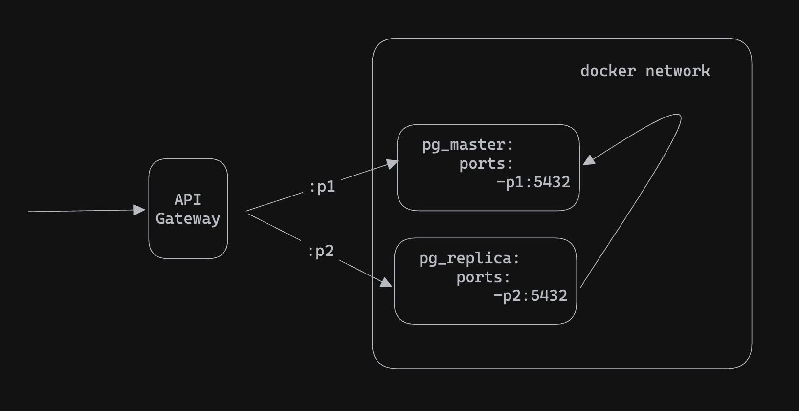

# Gin API with PostgreSQL Read Replica Setup

This project demonstrates a basic setup of a PostgreSQL read replica. The API supports reading from a replica database and writing to a master database.

## Prerequisites

- [Go](https://golang.org/dl/)
- [Docker](https://www.docker.com/get-started)
- [Docker Compose](https://docs.docker.com/compose/install/)
- [golang-migrate](https://github.com/golang-migrate/migrate/tree/master/cmd/migrate)
- [SQLC](https://sqlc.dev/) (for generating type-safe Go code from SQL queries)

## Project Structure

- `main.go`: The entry point of the API.
- `db/`: Contains the database queries and models.
- `.env.sample`: Sample environment file with required configuration.
- `docker-compose.yml`: Docker Compose configuration for setting up PostgreSQL master and replica databases.
- `run_migrations.sh`: Shell script to run database migrations.

## Getting Started

### 1. Set Up Environment Variables

Copy the sample environment file and modify it as needed:

```bash
cp .env.sample .env
```

### 2. Start the PostgreSQL Databases

Use Docker Compose to start the master and replica databases:

```bash
docker-compose up -d
```

### 3. Run Database Migrations

Ensure your migrations are up to date by running:

```bash
./run_migrations.sh
```

### 4. Generate Go Code from SQL Queries

Use SQLC to generate type-safe Go code from your SQL queries:

```bash
sqlc generate
```

### 5. Start the API

Run the API using Go:

```bash
go run main.go
```

### 6. Access the API

#### View All Users (Read from Replica)

Visit [http://localhost:8000/users](http://localhost:8000/users) in your browser to see all users. This data is read from the replica database.

#### Add a Random User (Write to Master)

Use the following `curl` command to add a random user to the master database:

```bash
curl -X POST http://localhost:8000/user
```

### 7. API Endpoints

- **GET `/users`**: Fetch all users from the replica database.
- **POST `/user`**: Create a new user in the master database.

## Troubleshooting

- **Database Connection Issues**:
  - Ensure that the `.env` file contains the correct database connection strings.
  - Verify that the PostgreSQL containers are running with `docker-compose ps`.

- **Migrations**:
  - Ensure that your migrations are correctly configured and executed on both the master and replica databases.

## Credits

https://medium.com/@eremeykin/how-to-setup-single-primary-postgresql-replication-with-docker-compose-98c48f233bbf